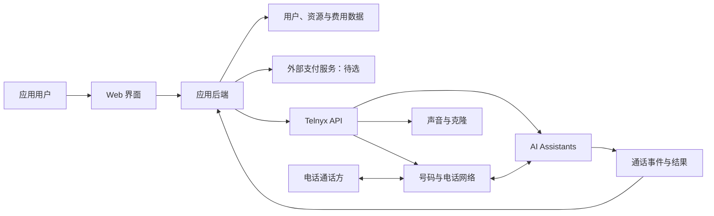

# Easy Voice — 产品与技术基础 Spec

版本：0.3

整理日期：2026-10-07

状态：已确认方针的开发基线；第 12 节待确定事项已于 v0.2 在第 16 节收敛为 MVP 决策；v0.3 根据真实来电测试更新模型组合。

## 1. 文档用途

本文整理当前讨论中已经确认的产品定位、能力范围和技术方针，作为后续需求细化、技术设计和开发的共同依据。

本文不是完整 PRD，也不表示已经完成供应商账号配置或真实电话验证。下文分别标识：

- **已确认**：用户已经明确接受的方向和范围。
- **实现约束**：为实现该方向所需的基本工程边界，不代表已选定实现技术。
- **待确定**：尚未讨论或验证的细节，开发时不得视为默认已批准的需求。

项目目录名用于本文标题，不表示已确定正式产品名称。

## 2. 产品定位与目标用户〔已确认〕

开发一个面向个人用户的 Web 服务，将外部平台已有的电话和 Voice Agent 能力整合进统一界面。

| 项目 | 结论 |
| --- | --- |
| 使用场景 | 个人语音助理 |
| 目标市场 | 美国 |
| 号码范围 | 优先美国号码；具体号码类型待确定 |
| 主要通话语言 | 英语和中文；中文具体语种待确定 |
| 产品形式 | 外部能力整合与界面封装，保持简单 |
| 核心供应商 | Telnyx |
| 当前目标 | 核心能力、用户系统及付费系统形成完整闭环 |

当前不研究商业化策略或产品差异化，也不围绕行业模板扩展需求。

## 3. 技术方针〔已确认〕

**Telnyx 单平台作为底层核心接入；其他模型、Voice 等能力后续按需接入。**

1. 号码搜索、购买和管理优先使用 Telnyx。
2. 声音选择与克隆优先使用 Telnyx 已有能力。
3. Agent 创建、配置和运行优先使用 Telnyx AI Assistants。
4. 电话接听与拨打优先使用 Telnyx 电话能力。
5. 核心语音能力全部使用外部服务，不自建实时语音识别、语音合成、模型推理或 Agent 编排引擎。
6. 出现实际需求或效果不足时，再接入其他模型或声音服务；优先利用 Telnyx 支持的集成方式。
7. 第一版不以多供应商切换或多模型选择界面作为默认需求。
8. 内部保留必要的供应商接口封装，避免前端和业务数据直接绑定某个供应商的实现细节。

“单平台”指我们主要对接 Telnyx 的账户、API 和运行能力，并不要求 Telnyx 内部使用的模型全部由其自研或运行在同一种基础设施上。

## 4. 能力范围〔已确认〕

| 能力域 | 产品需要提供的能力 | 基础接入方向 |
| --- | --- | --- |
| 用户 | 用户账户、登录及个人资源管理 | 应用负责，具体认证方案待选 |
| 号码 | 选择、购买及管理号码 | Telnyx Numbers |
| 声音 | 选择可用声音、克隆声音并用于 Agent | Telnyx Voice / Voice Design Lab |
| Agent | 创建、配置及管理 Voice Agent | Telnyx AI Assistants |
| 电话 | Agent 接听来电和主动拨打电话 | Telnyx 电话能力 |
| 记录 | 查看通话记录、可用转写、摘要及录音 | Telnyx 数据与事件；内容受配置及保留策略影响 |
| 付费 | 支付、用量及用户费用记录形成闭环 | 应用负责，支付服务和计费方式待选 |

Agent 的配置以 Telnyx 实际提供的能力为依据。后续从其中选择产品需要呈现的配置项，不自行构建复杂配置体系，也不要求完整复制 Telnyx 控制台的全部功能。

## 5. 产品能力闭环〔已确认的目标〕

用户能够在我们的 Web 服务中完成以下过程：

> 创建账户 → 完成付费或取得有效使用额度 → 获取号码 → 选择或克隆声音 → 创建 Agent → 关联号码与 Agent → 接听或拨打电话 → 查看通话结果、用量和费用。

上述顺序用于描述能力之间的关联，不固定页面顺序、开通步骤或购买前后的交互。是否支持浏览器试聊、试听以及免费试用，后续单独确定。

闭环不仅包括成功通话，还需要能够解释号码开通失败、声音创建失败、Agent 启动失败、电话未接通和支付失败等实际结果。

## 6. 平台与供应商的职责边界〔实现约束〕

### 6.1 Telnyx 提供

- 号码库存、采购和电话网络连接。
- 可选的声音模型、声音克隆和语音合成。
- Agent 的运行、语音识别、对话处理及平台提供的工具能力。
- 电话接听、呼出及相应的通话状态。
- 平台可提供的通话数据、事件和用量依据。

### 6.2 我们的应用提供

- 统一 Web 界面和应用用户身份。
- 用户与号码、声音、Agent、通话之间的资源归属。
- 用户操作与 Telnyx API 之间的连接和状态同步。
- 支付结果、使用资格、用量及费用记录。
- 必要的失败处理、事件去重和状态恢复。

用户不会因为使用本产品而默认需要自行操作 Telnyx 控制台。供应商账户由平台统一管理还是由用户连接自己的账户，仍需在开发前确定。

## 7. 概念性系统结构〔实现约束〕

这是职责示意，不指定框架、数据库、部署平台、任务队列或进程结构。正常通话的实时音频处理交给外部平台，我们的后端处理配置、权限、事件和业务数据。

## 8. 资源与数据关系〔实现约束〕

以下是逻辑对象，不是已确定的数据库表结构。

| 对象 | 需要保留的关系 |
| --- | --- |
| 用户 | 应用身份及个人资源归属 |
| 号码 | 所属用户、供应商号码标识、开通状态及 Agent 关联 |
| 声音 | 所属用户或公共可用范围、供应商声音标识、类型及可用状态 |
| Agent | 所属用户、供应商 Assistant 标识、配置及声音关联 |
| 通话 | 所属用户、Agent、号码、供应商通话与会话标识、状态及可用结果 |
| 支付 | 所属用户、外部支付标识及支付状态 |
| 用量与费用 | 所属用户、对应资源或通话、计费依据及结算状态 |

基本边界：

- 声音、Agent 和号码分别管理，通过关联组成通话能力。
- 保留应用内部标识与供应商标识的映射，便于同步和后续替换。
- 业务资源的访问以应用中的归属和权限判断为准。
- 不假定号码与 Agent 永远一对一；第一版的数量和关联规则待确定。
- 供应商侧用量与我们的用户账单分别记录，不能直接把供应商账户总费用视为某个用户的费用。

## 9. 状态同步与费用闭环〔实现约束〕

### 9.1 外部操作的结果

API 请求已接受、资源已创建、资源已可用和实际操作成功，应分别判断。

例如，号码订单提交成功后，需要确认开通状态；声音克隆若异步处理，需要确认声音已经可用；外呼请求成功后，还需确认电话是否接通及 Agent 是否正常运行。

具体状态枚举以选定 API 和实现方案为准。

### 9.2 事件处理

供应商事件按对应产品的签名规则验证。事件处理应允许重复到达以及异步结果，并避免重复创建资源或重复计费。必要时使用查询 API 补齐状态。

### 9.3 费用和使用资格

支付、供应商用量与用户费用之间需要可追溯的关联。金额或额度单位必须明确，供应商成本与产品收费规则不得混用。

充值余额、订阅、按用量后付费或其组合尚未选定。余额不足、支付失败及用户停用时如何处理来电、已有号码和正在进行的通话，也尚未确定。

## 10. 当前不纳入默认范围〔已确认边界及未采纳项〕

- 行业模板、行业专用业务流程。
- 商业化策略、市场定位比较及差异化设计。
- 自建语音识别、语音合成、模型推理或实时 Agent 编排。
- 第一版同时接入多个 Voice Agent 平台。
- 在没有明确需求的情况下扩展复杂配置和工作流。

批量外呼、CRM、日历、知识库、长期记忆、短信、号码携入、转人工、IVR 导航及浏览器试聊等供应商能力，本轮均未确认为产品需求。后续可按需选择，不因供应商支持就自动纳入开发。

## 11. 供应商调研结论与验证边界

### 11.1 文档层面已核实

- Telnyx 提供号码搜索、下单和状态查询能力。
- Telnyx 提供声音克隆 API，克隆声音可以用于 AI Assistants。
- AI Assistants 可以接听来电，并通过电话 API 或计划事件发起外呼。
- 电话和会话有状态事件、消息及分析能力，可以用于构建结果展示。
- 语音识别和合成可选择不同模型；语言覆盖必须按具体模型确认。

### 11.2 尚未完成

- 供应商账户、权限、验证等级、容量和面向终端用户提供服务的条件确认。
- 美国号码的真实搜索、购买与开通验证。
- 克隆声音在英语与中文中的相似度和自然程度测试。
- 英中文切换、中英文混合表达及电话音质下的识别测试。
- 真实来电、外呼、打断、挂断和失败恢复验证。
- 供应商用量字段与实际账单的对账。

调研中提到的价格、模型名单和容量是时点信息，不作为固定产品规则。实现时重新核实所选配置的可用性、单位和费用。

## 12. 开发前待确定事项

| 事项 | 需要确定的内容 |
| --- | --- |
| 账户模式 | 平台统一供应商账户，还是用户连接个人供应商账户 |
| 用户系统 | 注册、登录方式及认证服务 |
| 付费系统 | 支付供应商、付费方式、费用规则和使用资格判断 |
| 初始模型组合 | 英中文 STT、LLM、TTS 和克隆模型 |
| 中文范围 | 初始支持普通话还是其他中文语种 |
| 号码范围 | 初始号码类型、购买条件及释放流程 |
| Agent 配置 | 在界面上暴露哪些 Telnyx 配置项 |
| 资源数量 | 每位用户的号码、声音、Agent 及并发限制 |
| 数据策略 | 录音是否启用、转写和音频的保留与删除方式 |
| 技术实现 | 框架、数据库、存储、部署及事件处理方式 |

这些问题应在对应实现开始前收敛，不在本文中凭空设定默认答案。

> v0.2：上述事项已全部确定，见第 16 节。

## 13. 后续验证的完成标准

以下用于检查最终闭环是否成立，不指定当前立即实现全部细节：

1. 用户可以在 Web 服务中管理自己的号码、声音及 Agent。
2. 用户可以获取可用美国号码，并将其关联到自己的 Agent。
3. 用户可以选择或克隆声音，并实际用于 Agent 通话。
4. Agent 可以接听真实来电并发起真实外呼。
5. 选定配置可以完成英语和中文电话交流；具体效果标准另行确定。
6. 成功和失败通话都有可查询、归属正确的结果。
7. 支付、使用资格、用量和用户费用能够关联并核对。
8. 不同用户的资源和记录按权限隔离。

## 14. 官方参考资料

下列资料来自前期官方文档调研，访问时点为 2026-10-07。开发时应以供应商最新文档及实际 API 响应为准。

- [Telnyx 号码搜索](https://developers.telnyx.com/docs/numbers/phone-numbers/number-search)
- [Telnyx 号码订单](https://developers.telnyx.com/docs/numbers/phone-numbers/number-orders)
- [Telnyx AI Assistant 快速开始](https://developers.telnyx.com/docs/inference/ai-assistants/no-code-voice-assistant)
- [Telnyx 声音克隆参数](https://developers.telnyx.com/docs/voice/voice-design-lab/clone-voice/parameters)
- [将克隆声音用于 Assistant](https://developers.telnyx.com/docs/voice/voice-design-lab/using-custom-voices)
- [Telnyx Assistant 语音识别配置](https://developers.telnyx.com/docs/inference/ai-assistants/transcription-settings)
- [Telnyx 可用 TTS 声音](https://developers.telnyx.com/docs/voice/tts/available-voices)
- [接听电话并启动 Assistant](https://developers.telnyx.com/docs/voice/programmable-voice/ai-assistant-start)
- [Telnyx 拨号 API](https://developers.telnyx.com/api-reference/call-commands/dial)
- [Telnyx Assistant 计划事件](https://developers.telnyx.com/docs/inference/ai-assistants/scheduled-events)
- [Telnyx Voice AI 定价](https://telnyx.com/pricing/voice-ai-agents)

## 15. 后续文档维护

后续新增或更改方针时更新本文；具体页面流程、API 设计、数据库结构及部署方案另行细化，并明确关联到这里的能力范围。未经讨论的供应商高级能力不得因文档或 API 已存在而自动变成产品需求。

## 16. MVP 决策〔已确认，v0.2，2026-10-07〕

| 事项 | MVP 决策 |
| --- | --- |
| 账户模式 | 平台统一 Telnyx 账户；用户不接触 Telnyx。所有供应商资源在应用内按用户归属记录。 |
| 用户系统 | 邮箱一次性验证码（OTP）+ Google OAuth；无密码。 |
| 付费系统 | Stripe 仅负责支付：通过 Stripe Checkout 一次性充值余额（最低 $10）。不使用任何订阅；号码月租、通话、克隆等全部从余额扣除。无免费试用额度，生产环境不存在绕过 Stripe 的充值方式；开发环境提供仅限开发的直接加余额工具（记为调整流水，不计为支付），生产构建中禁用。余额以美分整数记账，所有变动写入不可变流水。 |
| 费用规则 | 固定零售价，配置化：通话（呼入/呼出）每分钟、号码月租、每次声音克隆。初始占位：$0.15/分钟、$3/月/号码、$5/克隆。Telnyx 成本单独记录，用于对账，不直接作为用户收费。 |
| 使用资格 | 余额 ≤ 0：禁止外呼、拒接来电、禁止购买号码与克隆。余额持续为负超过 N 天（配置，默认 7）后释放号码。 |
| 初始模型组合 | 平台固定（配置化），用户不可选。经 2026-10-07 真实来电验证：STT 使用 `assemblyai/universal-3-5-pro`（语言 `auto`），可识别英语、普通话及中英混合；`deepgram/nova-3` 的 `auto` 模式会把普通话误识别为英文单词，不采用。LLM 显式固定为 `moonshotai/Kimi-K2.6`（Telnyx 托管，中文表现良好），不依赖 Telnyx 默认值。TTS：英语使用 KokoroTTS，普通话使用 Ultra（Telnyx 上普通话仅 Ultra 提供）。平台模型配置变更后，已有 Agent 自动重新同步。 |
| 中文范围 | 普通话。每个 Agent 设置主语言（英语 / 普通话）。粤语暂缓。 |
| 号码范围 | 仅美国本地号码（不含免费号码），按区号搜索。每用户最多 1 个号码。 |
| 资源数量 | 每用户 1 个号码、最多 3 个 Agent（同时仅 1 个关联号码）、最多 2 个克隆声音；并发通话 1。 |
| Agent 配置 | 名称、指令（system prompt）、开场白、主语言、声音（预置或克隆）。其他 Telnyx 配置使用平台默认值。 |
| 声音克隆 | 用户上传或录制样本，并勾选声明“本人声音或已取得说话人同意”；记录声明时间。 |
| 数据策略 | 开启录音；保存录音、转写、摘要 30 天后自动删除；用户可手动删除通话记录。开场白中包含录音告知。 |
| 技术实现 | Next.js（App Router，TypeScript）+ Postgres（Drizzle ORM）。先本地运行（Telnyx Webhook 经 ngrok），后续部署 Vercel。Telnyx 通过适配器接口接入，并提供 mock 实现，便于无凭证开发与测试。 |

浏览器试聊、试听、转人工、短信、工具调用等仍不在 MVP 范围内。

需要其他模型时（§3.6），优先使用 Telnyx 提供的集成方式：自带供应商密钥（`llm_api_key_ref`）、OpenAI 兼容的外部 LLM 端点（`external_llm`）、备用模型（`fallback_config`），以及目录中的第三方 TTS（如 MiniMax、ElevenLabs、Azure、AWS）。密钥保存在 Telnyx Integration Secrets 中，应用只引用其标识。目前无实际需求，暂不接入。
